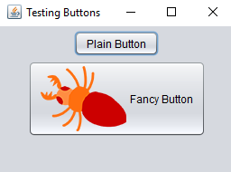

# Java Tutorial
This is a repository of various programs I have been doing 
to learn programming in Java. It was initially meant for to contain only Java programs but some program that are part of Challenges have JavaScript versions of them.

## Table of content

* [Status of project](#Status-of-project)
* [What topics are discussed](#What-topics-are-discussed)
* [Prerequisites](#prerequisites)
* [Author](#author)
* [Acknowledgements](#acknowledgements)

## Status of project

This project is at finished yet. More content will be added as I go along learning Java.

## What topics are discussed

The chapter starts at Chapter_2, basic of programming in Java. The coding includes loops, arrays, classes, methods, and it goes up to discussing GUI with the Swing Technology.
More topics are touched in the coding as each sub-directory in the chapters suggests. Here are screenshots of some the GUI built in the project 

 

## Prerequisites
JDK latest version recommended

## Author
* Claude DE-TCHAMBILA

## Acknowledgements
* Paul and Harvey Deitel
